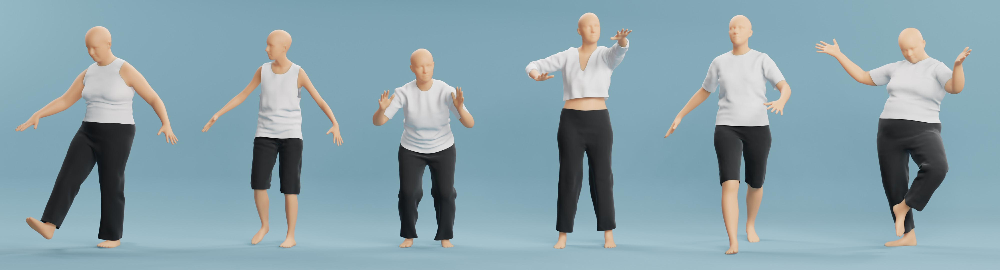

# SNUG: Self-Supervised Neural Dynamic Garments


This repository contains the code to run the trained models of SNUG.

## Abstract

> We present a self-supervised method to learn dynamic 3D deformations of garments worn by parametric human bodies. State-of-the-art data-driven approaches to model 3D garment deformations are trained using supervised strategies that require large datasets, usually obtained by expensive physics-based simulation methods or professional multi-camera capture setups. In contrast, we propose a new training scheme that removes the need for ground-truth samples, enabling self-supervised training of dynamic 3D garment deformations. Our key contribution is to realize that  physics-based deformation models, traditionally solved in a frame-by-frame basis by implicit integrators, can be recasted as an optimization problem. We leverage such optimization-based scheme to formulate a set of physics-based loss terms that can be used to train neural networks without precomputing ground-truth data. This allows us to learn models for interactive garments, including dynamic deformations and fine wrinkles, with a two orders of magnitude speed up in training time compared to state-of-the-art supervised methods.  

# Running the model

**Requirements**: ```python3.8```, ```tensorflow-2.7```, ```numpy-1.21.4```, ```scipy-1.7.2```

**(Recommended)** Create virtual environment:
```
python3 -m venv venv
source venv/bin/activate // Ubuntu
.\venv\Scripts\activate  // Windows
pip install -r requirements.txt
```

## Download human model

1. Sign in into https://smpl.is.tue.mpg.de
2. Download SMPL version 1.0.0 for Python 2.7 (10 shape PCs)
3. Extract ```SMPL_python_v.1.0.0.zip``` and copy ```smpl/models/basicModel_f_lbs_10_207_0_v1.0.0.pkl``` in ```assets/SMPL```

## Download animation sequences

We use sequences from AMASS to test our model. To download the sequences follow these steps:
1. Sign in into https://amass.is.tue.mpg.de
2. Download the body data for the CMU motions (SMPL+H model)
3. Extract ```CMU.tar.bz2``` in ```assets/CMU```:  
```sh
tar -C assets/ -xf ~/Downloads/CMU.tar.bz2 CMU/ 
```

## Generate garment animation

To generate the deformed garment meshes for a given sequence:

```sh
python run_snug.py --motion assets/CMU/07/07_02_poses.npz --garment tshirt  --savedir tmp/07_02
```
